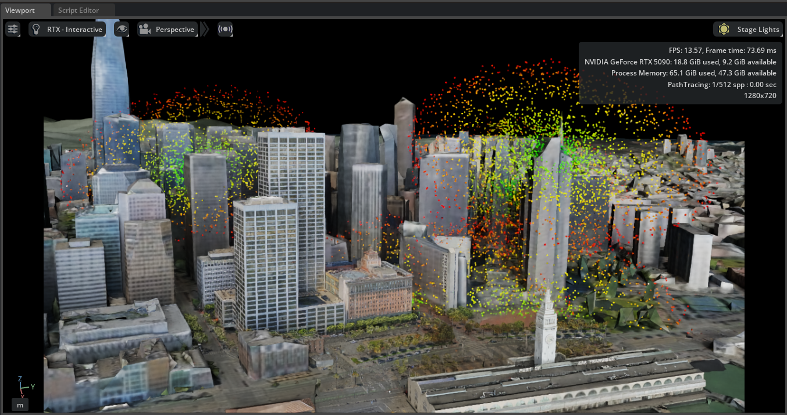

# Physical AI Digital Twin: Geospatial RF Propagation & Coverage Optimization Platform



## Overview

This project provides real-time visualization of 5G RF (Radio Frequency) signal propagation in dense urban environments using NVIDIA Isaac Sim 4.5 and Cesium for Omniverse. It generates interactive heatmaps showing signal strength and coverage patterns from multiple cell tower locations.

**Platform**: NVIDIA Isaac Sim 4.5.0 (Python 3.10)

**Core Architecture**:
- **Core Logic**: A reactive OpenUSD stage using `UsdGeom.Points` for high-performance GPU-resident visualization
- **Geospatial Layer**: Cesium for Omniverse streaming Aerometrex San Francisco 3D Tiles
- **Rendering**: Real-time GPU-accelerated point cloud visualization with gradient color mapping

## Demo Video


*Interactive 5G signal heatmap with real-time controls*


## Current Capabilities (Foundation)

### 1. Tower Detection
Automatically traverses the USD Stage to find `Tower_*` prims. The system scans the scene graph and identifies all visible tower assets, extracting their world-space positions for signal calculation.

### 2. Parametric Heatmap
Generates concentric distance rings using **polar-to-cartesian mapping**: 

$$x = r \cdot \cos(\theta), \quad y = r \cdot \sin(\theta)$$

This creates omnidirectional coverage patterns that accurately represent isotropic antenna radiation.

### 3. Real-Time UI
Utilizes `omni.ui` to provide live tuning of simulation parameters:
- `MAX_SIGNAL_RANGE`: Maximum propagation distance (50-2000m)
- `MIN_SIGNAL_RANGE`: Near-field boundary (1-50m)
- `POINTS_PER_TOWER`: Visualization density (100-4000 points)
- `POINT_SIZE`: Visual scale of signal dots (1-10)

### 4. Signal Simulation
Implements a **linear inverse-distance falloff model** to calculate signal strength (0-100%) mapped to an RGB gradient:

- **Red** (0-33%) → Weak/no signal
- **Yellow** (33-66%) → Medium signal  
- **Green** (66-100%) → Strong signal

## Development Roadmap (Advanced Features)

### Phase 1: PhysX Occlusion (In Development)
Move from "transparent" signals to a **ray-casting model** that detects building collisions. This will provide realistic signal blockage and shadow zones behind structures.

**Approach**: 
- Extract building mesh data from Cesium tilesets
- Implement custom raycasting using Trimesh or PyEmbree
- Apply attenuation factors based on intersection distances

### Phase 2: Optimization Engine
Implement a **Greedy Solver** that automatically adjusts tower positions to:
- Maximize "Green" coverage points
- Minimize "Red" interference zones
- Balance tower count vs. coverage density

**Algorithm**: Iterative hill-climbing with signal strength cost function.

### Phase 3: DSP Integration
Incorporate advanced propagation effects:
- **Rain Fade**: Frequency-dependent signal attenuation in adverse weather
- **Multi-path Reflections**: Surface bounce modeling based on material properties
- **Material Database**: Differentiate between Concrete (15dB loss), Glass (3dB loss), and Foliage (0.5dB/m)

**Models**: ITU-R P.1411 for urban environments, ITU-R P.838 for rain attenuation.

## Features

- **Real-time gradient heatmap visualization** with smooth color transitions (Red → Yellow → Green)
- **Physics-based signal propagation** using inverse square law
- **Interactive UI controls** with live adjustable parameters
- **Multi-tower support** with automatic tower detection
- **Geospatial accuracy** with Cesium photogrammetry integration
- **High performance** rendering on NVIDIA RTX GPUs

## Technical Details

### Signal Propagation Model

The system calculates signal strength using a linear inverse relationship based on distance:

```python
signal_strength = 100.0 × (max_distance - distance) / (max_distance - min_distance)
```

This provides a simplified but effective model where:
- **100% signal strength** at minimum distance (5m from tower)
- **0% signal strength** at maximum distance (default 150m)
- **Linear falloff** between these points

### Spatial Distribution

The visualization uses **polar coordinates** to distribute signal sample points uniformly around each tower:

```python
# Polar to Cartesian conversion
target_x = tower_x + distance × cos(angle)
target_y = tower_y + distance × sin(angle)
```

**Why sine and cosine?**

- **`cos(angle)`** computes the X-component (horizontal displacement)
- **`sin(angle)`** computes the Y-component (vertical displacement)
- **`angle`** ranges from 0 to 2π (360 degrees)

This creates a circular radiation pattern around each tower, accurately representing omnidirectional antenna behavior. By sampling multiple angles and distances, we generate a dense point cloud that visualizes signal propagation in all directions.

### Distance Rings

To ensure consistent gradient visualization across all runs, the system uses **distance bands**:

```python
num_rings = 20  # Evenly-spaced distance rings
points_per_ring = points_per_tower // num_rings

for ring_idx in range(num_rings):
    ring_progress = ring_idx / (num_rings - 1)
    distance = min_range + (max_range - min_range) × ring_progress
```

This approach:
- Divides the signal range into 20 concentric rings
- Distributes points evenly across each ring
- Ensures full color spectrum is always represented
- Provides deterministic, reproducible results

### Color Mapping

The gradient color function maps signal strength to RGB values:

```python
if signal_strength > 50%:
    # Strong signal: Yellow (1,1,0) → Green (0,1,0)
    r = 1.0 - ((signal_strength - 50) / 50)
    g = 1.0
else:
    # Weak signal: Red (1,0,0) → Yellow (1,1,0)
    r = 1.0
    g = signal_strength / 50
```

**Color Scale:**
- 🔴 **Red** (0-33%): Weak/no signal
- 🟡 **Yellow** (33-66%): Medium signal  
- 🟢 **Green** (66-100%): Strong signal

## System Requirements

- **NVIDIA Isaac Sim 4.5.0** or later
- **Cesium for Omniverse** plugin
- **NVIDIA RTX GPU** (tested on RTX 4090/5090)
- **Python 3.10** (included with Isaac Sim)
- **OpenUSD** (Universal Scene Description)

## Setup Instructions

### 1. Install Isaac Sim

Download and install NVIDIA Isaac Sim 4.5 from:
```
https://developer.nvidia.com/isaac-sim
```

### 2. Load the Scene

1. Launch Isaac Sim
2. Open the USD scene file:
   ```
   File → Open → georgetown1.usd
   ```
3. Wait for the Cesium tileset to load completely

### 3. Run the Script

1. Open the Script Editor:
   ```
   Window → Script Editor
   ```

2. Load and run the script:
   ```
   File → Open → 5G.py
   ```

3. Click **Run** (or press `Ctrl+Enter`)

### 4. Use the Controls

A floating control panel will appear with four sliders:

| Parameter | Range | Description |
|-----------|-------|-------------|
| **Max Range (m)** | 50-2000 | Maximum signal propagation distance |
| **Min Range (m)** | 1-50 | Minimum distance from tower |
| **Points Per Tower** | 100-4000 | Visualization density (higher = smoother) |
| **Point Size** | 1-10 | Size of each signal dot |

**To update the visualization:**
1. Adjust the sliders to desired values
2. Click **Refresh Heatmap** button
3. The visualization updates in real-time

## Configuration

Edit the top of `5G.py` to change default values:

```python
# Signal Range (in meters)
MAX_SIGNAL_RANGE = 150.0
MIN_SIGNAL_RANGE = 5.0

# Visualization Density
POINTS_PER_TOWER = 400

# Point Appearance
POINT_SIZE = 4.0
```

## Scene Structure

The USD scene consists of:

- **Cesium Tileset**: Aerometrex San Francisco photogrammetry
- **Tower Assets**: User-placed cylinder prims (Tower_01, Tower_02, etc.)
- **Signal Visualizer**: UsdGeom.Points prim at `/World/Signal_Visualizer`

### Adding Towers

1. In Isaac Sim, create a new **Cylinder** prim
2. Name it with "Tower" prefix (e.g., `Tower_06`)
3. Position it at desired location (typically on rooftops)
4. Run the script - it automatically detects all visible towers

### Hiding Towers

Toggle the visibility (eye icon) in the Stage panel to exclude towers from simulation.

## Performance

**Recommended Settings:**
- **Points Per Tower**: 400 (2000 total for 5 towers)
- **Max Range**: 150m for urban environments
- **Expected FPS**: 60+ on RTX 5090

**For Large Scenes:**
- Reduce `POINTS_PER_TOWER` to 200-300
- Lower `MAX_SIGNAL_RANGE` to focus on nearby coverage
- Fewer towers = better performance

## Output Statistics

The console displays detailed statistics after each run:

```
✓ Heatmap generated successfully!
  Total points: 2,000
  Points per tower: 400
  Signal range: 5.0m - 150.0m

  Signal Strength Stats:
    Min: 0.0%  Max: 100.0%  Avg: 50.0%
    
  Color Distribution:
    🔴 Red (<33%): 667 points (33.4%)
    🟡 Yellow (33-66%): 629 points (31.4%)
    🟢 Green (>66%): 704 points (35.2%)
```

## Limitations

- **No building occlusion**: Signals pass through structures (simplified model)
- **Omnidirectional pattern**: Assumes isotropic antennas (real antennas are directional)
- **No multi-path effects**: Does not model reflections or diffraction
- **Simplified propagation**: Uses linear falloff instead of ITU-R or Longley-Rice models

## Future Enhancements

- Ray-tracing for building occlusion detection
- ITU-R P.1411 urban propagation model
- Frequency-dependent attenuation (3.5 GHz, 28 GHz, etc.)
- Directional antenna patterns
- Multi-path reflection simulation
- Real-world validation against coverage measurements

## License

This project is provided as-is for educational and research purposes.

## Credits

- **Platform**: NVIDIA Isaac Sim 4.5
- **Geospatial Data**: Cesium for Omniverse with Aerometrex San Francisco tileset
- **Visualization**: OpenUSD (Universal Scene Description)

---

**Questions or issues?** Check the console output for detailed statistics and error messages.

